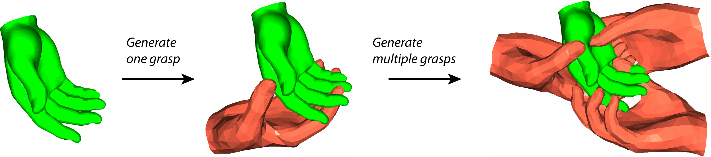

<br />
<p align="center">
  <p align="center">
    
  </p>
  <h2 align="center">OakInk-Shape Benchmark</h2>

  <p align="center">
    <a href="https://lixiny.github.io"><strong>Lixin Yang*</strong></a>
    ·
    <a href="https://kailinli.top"><strong>Kailin Li*</strong></a>
    ·
    <a href=""><strong>Xinyu Zhan*</strong></a>
    ·
    <strong>Fei Wu</strong>
    ·
    <a href="https://anran-xu.github.io"><strong>Anran Xu</strong></a>
    .
    <a href="https://liuliu66.github.io"><strong>Liu Liu</strong></a>
    ·
    <a href="https://mvig.sjtu.edu.cn"><strong>Cewu Lu</strong></a>
  </p>
  <h3 align="center">CVPR 2022</h3>


  <p align="center">
    <a href="https://arxiv.org/abs/2203.15709">
      
    </a>
    <a href='https://oakink.net'>
      </a>
    <a href="https://www.youtube.com/watch?v=vNTdeXlLdU8"></a>
  </p>
</p>

This repo contains the training and evaluation of three Grasp Generation models on OakInk-Shape dataset.

* [**GrabNet**](https://github.com/otaheri/GrabNet) : Generating realistic hand mesh grasping unseen 3D objects (ECCV 2020)    
* **IntGen** -- Intent-based Grasp Generation: grasps that align with the intentions behind the object's use.
* **HoverGen** -- Handover Generation: hand poses for handing over objects to a recipient.


## Table of content
- [Installation](#installation)
- [Grasp one app](#grasp-one)
- [Visualization](#visualization)
- [Evaluation](#evaluation)
- [Training](#training)


## Installation 
Create a conda env from `environment.yml`:
```bash
conda env create -f environment.yml  
conda activate oishape_bm  
```  
Install dependencies:
```bash
pip install -r requirements.txt
pip install -r requirements@git.txt
```  
Install OakInk data toolkit (**oikit**) as package:
```bash
pip install git+https://github.com/oakink/OakInk.git
``` 
Link the [OakInk dataset](https://github.com/oakink/OakInk/blob/main/docs/datasets.md#download-full-oakink):
```bash
ln -s {path_to}/OakInk ./data
```

Get the [MANO hand model](https://github.com/oakink/OakInk/blob/main/docs/install.md#get-mano-asset): 
```bash 
cp -r {path_to}/mano_v1_2 ./assets
```

Download the pretrained model weights from [Google Drive](https://drive.google.com/drive/folders/140Lsl9MnmDCIH38tkza3yRCyoG9gk88O?usp=share_link)
and put the contents in `./checkpoints`.

Now this repo is ready to generate grasp, visualize, and train models.   
If you also want to [evaluate grasp quality](#evaluation), there are several extra packages to build, see [`docs/eval_tools.md`](docs/eval_tools.md)


##  Grasp one 
Using our pre-trained GrabNet model to generate multiple grasps on your own object.
```bash
python scripts/grasp_new_obj.py --obj_path $OBJ_PATH --n_grasps 10 
```
options for `grasp_new_obj.py`:
* `--obj_path`: path to the `.obj` or `.ply` file of the object to be grasped.
* `--n_grasps`: number of grasps to generate, default `1`.
* `--mano_path`: path to MANO hand model, default in `assets/mano_v1_2`.
* `--rescale`: whether to rescale the object inside a radius=0.1m sphere, default `False`.
* `--save`: whether to save the generated grasps, default `False`, saved at `demo/grasps/{timestamp}`.

to run example, set `OBJ_PATH` to `assets/demo_hand.ply`:
<p align="center">
  
</p>


## Visualization

Visualize the generation model trained on OakInk-Shape `train` set.  
The hand in blue is the result of CoarseNet and the hand in red is the result of RefineNet.

Here we detail several `argparse` options:  
* `--cfg`: path to the config file.
* `-b, --batch_size`: batch size for inference.
* `-g, --gpu_id`: gpu id used for inference.
* `--split`: which split to visualize, `train`, `val` or `test`.


**GrabNet** model on the OakInk-Shape `test` set:
```bash
python scripts/viz_grabnet_gen.py -b 1 -g 0 --split test --cfg config/oishape_bm/test_GrabNet_OIShape.yml 
```

**IntGen** model on the OakInk-Shape `test` set:
```bash
# obj category: trigger_sprayer, intent: use. 
python scripts/viz_grabnet_gen.py -b 1 -g 0 --split test --intent use \
     --cfg config/oishape_bm/intent/test_GrabIntentNet_OIShape_trigger.yml 

# obj category: trigger_sprayer, intent: hold.
python scripts/viz_grabnet_gen.py  -b 1 -g 0 --split test --intent hold \
    --cfg config/oishape_bm/intent/test_GrabIntentNet_OIShape_trigger.yml 
```

**HoverGen** model on the OakInk-Shape `test` set:
```bash
python scripts/viz_grabnet_gen.py -b 1 -g 0 --split test \
    --cfg config/oishape_bm/handover/test_GrabHandoverNet_OIShape.yml 
```


## Evaluation 

### Process object meshes
Before evaluating the grasps' quality, we need to first pre-process the object meshes. This involves 
a three-stage pipeline.
1. **Watertight using [ManifoldPlus](https://github.com/hjwdzh/ManifoldPlus)**: make the object mesh watertight.
2. **Voxelization using [binvox](https://www.patrickmin.com/binvox/)**: convert the object mesh to voxel representation.
3. **Convex Decomposition using [V-HACD](https://github.com/kmammou/v-hacd)**: produce a convex decomposition of the object meshes.

If you have fully completed the [installation](#installation), then the corresponding tools should be installed and ready to use.
Run the following commands sequentially. Results will be saved at `data/OakInkShape_object_process` by default.

options: 
* `--proc_dir`: specify the directory to save the processed object meshes, default `data/OakInkShape_object_process`.
* `--stage`: which stage to run, `watertight`, `voxel` or `vhacd`, default `watertight`.
* `--n_jobs`: number of parallel jobs, default `8`.

```bash
# 1. watertight, this may take 20 mins when n_jobs=8
python scripts/process_obj_mesh.py --stage watertight

# 2. voxelization, this may take 20 mins when n_jobs=32
# if you are using a remote server, 
# you may need to run the following commands to enable binvox's headless rendering.
# Xvfb :1 -screen 0 1024x768x24 &
# export DISPLAY=:1
python scripts/process_obj_mesh.py --stage voxel

# 3. convex decomposition with VHACD, this may take 5 mins when n_jobs=32
python scripts/process_obj_mesh.py --stage vhacd
```

### Evaluate grasp quality
The evaluation metrics include:  
* [Penetration Depth](lib/metrics/penetration.py)
* [Penetration Volume](lib/metrics/intersection.py)
* [Disjointed Distance](lib/metrics/disjointedness.py)
* [Simulation Displacement](lib/metrics/simulator.py)

The evaluation process will be separated into two steps: 1) dumping the generation results to disk  (`dump_grabnet_gen.py`), then 2) evaluating the grasp's quality (`evaluate_grasps.py`).

#### Dumping stage
```bash
# GrabNet model
python scripts/dump_grabnet_gen.py -b 1 -g 0 --split test --exp_id eval_grabnet \
    --cfg config/oishape_bm/test_GrabNet_OIShape.yml 

# HoverGen model
python scripts/dump_grabnet_gen.py -b 1 -g 0 --split test --exp_id eval_hovergen \
    --cfg config/oishape_bm/handover/test_GrabHandoverNet_OIShape.yml
```
This will create a exp directory at `EXP_DIR=exp/{exp_id}_{timestamp}`. The dumped generation results will be stored in `$EXP_DIR/results`. Each grasp is saved in a file titled `{obj_id}_{grasp_id}.pkl`.


#### Evaluation stage
Set the `--exp_path` to `$EXP_DIR`. If you specify `--proc_dir` when [process object mesh](#process-object-meshes), you need to specify it here as well.
```bash
python scripts/evaluate_grasps.py --exp_path $EXP_DIR --n_jobs 8  
```
The evaluation results will be saved at `$EXP_DIR/evaluations`:
* `Metric.txt`: the mean value of each metric over all grasps.
* `eval_res.pkl`: a list that contains a dict of evaluation metrics for each grasp.

## Training
We first detail several `argparse` options

* `-c, --cfg`: path to the config file.
* `-g, --gpu_id`: gpu id(s) used for training.
* `-w, --num_workers`: number of workers for data loading.
* `-b, --batch_size`: batch size on each device, if not specified, will use the one in cfg file.
* `-p, --dist_master_port`: port for ddp, default `60001`. specify different ports for different trainings.
* `--exp_id`: experiment id, `default` if not specified.
* `--log_freq`: tensorboard logging frequency, default `10`.
* `--snapshot`: model saving frequency, default `5`.    

For details please refer to [`opt.py`](lib/opt.py). All training exps run on a single TITAN X (Pascal) 12G. Training checkpoints will be saved at `exp/{exp_id}_{timestamp}`.  

**GrabNet** model on the OakInk-Shape `train` set:
```bash
# GrabNet = CoarseNet + RefineNet.

# train CoarseNet 
python scripts/train_ddp.py -g 0 -w 4 --exp_id cnet_oishape \
    --cfg config/oishape_bm/train_CoarseNet_OIShape.yml

# train RefineNet
python scripts/train_ddp.py -g 0 -w 4 --exp_id rnet_oishape \
    --cfg config/oishape_bm/train_RefineNet_OIShape.yml 
```


**IntGen** model on the OakInk-Shape `train+val` set:
```bash
# IntGen = CoarseIntentNet + RefineNet. only CoarseIntentNet is trained.

# train CoarseIntentNet
python scripts/train_ddp.py -g 0 -w 4 --exp_id cintentnet_trigger \
    --cfg config/oishape_bm/intent/train_CoarseIntentNet_OIShape_trigger.yml 
```

**HoverGen** model on the OakInk-Shape `train+val` set:
```bash
# HoverGen = CoarseHandoverNet + RefineHandoverNet. 

# train CoarseHandoverNet
python scripts/train_ddp.py -g 0 -w 4 --exp_id chandovernet_oishape \
    --cfg config/oishape_bm/handover/train_CoarseHandoverNet_OIShape.yml 

# train RefineHandoverNet
python scripts/train_ddp.py -g 0 -w 4 --exp_id rhandovernet_oishape \
    --cfg config/oishape_bm/handover/train_RefineHandoverNet_OIShape.yml 
```


## Citation

If you find OakInk-Shape dataset useful for your research, please considering cite us:  
```bibtex
@inproceedings{YangCVPR2022OakInk,
  author    = {Yang, Lixin and Li, Kailin and Zhan, Xinyu and Wu, Fei and Xu, Anran and Liu, Liu and Lu, Cewu},
  title     = {{OakInk}: A Large-Scale Knowledge Repository for Understanding Hand-Object Interaction},
  booktitle = {IEEE/CVF Conference on Computer Vision and Pattern Recognition (CVPR)},
  year      = {2022},
}
```